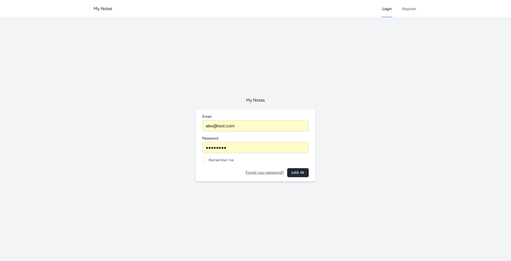

# Sent Notes App Documentation

## Table of Contents

1. [Introduction](#introduction)
2. [Features](#features)
3. [Getting Started](#getting-started)
    - [Prerequisites](#prerequisites)
    - [Installation](#installation)
4. [Usage](#usage)
    -[Welcome](#welcome)
    - [Dashboard](#dashboard)
    - [Notes](#notes)
    - [Profile](#profile)
    - [Login/Register](#loginregister)
5. [Contributing](#contributing)
6. [License](#license)

## Introduction

Sent Notes is a web application designed to help users keep track of important information by creating and managing notes. It is built on the Laravel framework, utilizing Tailwind CSS for styling, Livewire for dynamic user interfaces, WireUI for UI components, and MySQL for the database.

## Features

-   Create, edit, and delete notes.
-   Organize notes with pages.
-   User-friendly dashboard.
-   User authentication and registration.
-   Profile management.

## Getting Started

### Prerequisites

Make sure you have the following installed on your machine:

-   [PHP](https://www.php.net/) (>= 7.3)
-   [Composer](https://getcomposer.org/)
-   [Node.js](https://nodejs.org/)
-   [npm](https://www.npmjs.com/)
-   [MySQL](https://www.mysql.com/) database

### Installation

1. Clone the repository:

    ```bash
    git clone https://github.com/yourusername/sent-notes-app.git

    ```

2. Navigate to the project directory:

```bash
cd sent-notes-app
```

3. Install PHP dependencies:

```bash
composer install
```

4. Install JavaScript dependencies:

```bash

npm install

```
5. Copy the .env.example file to .env and configure your database settings.

6. Generate the application key:

```bash

php artisan key:generate
```

7. Run migrations:

```bash

php artisan migrate
```

8. Compile assets using npm:

```bash
npm run dev
```

9. Start the development server:

```bash
php artisan serve
```

10. Your app should now be running at http://localhost:8000.

## Usage

### Welcome
Welcome page provides infos about the application


### Login/Register

- **Login**: Existing users can log in using their credentials.

- **Register**: New users can register for an account.


### Dashboard

The dashboard provides an overview of your notes.


### Notes


- **Create Note**: Click on the "Create Note" button to compose a new note.


- **See Note**: Click on the "eye" button to see a note.


### Profile

- **View Profile**: Access your user profile information and update it.


## Contributing

Contributions are welcome! If you'd like to contribute, please follow our [Contribution Guidelines](CONTRIBUTING.md).

## License

This project is licensed under the [MIT License](LICENSE).
